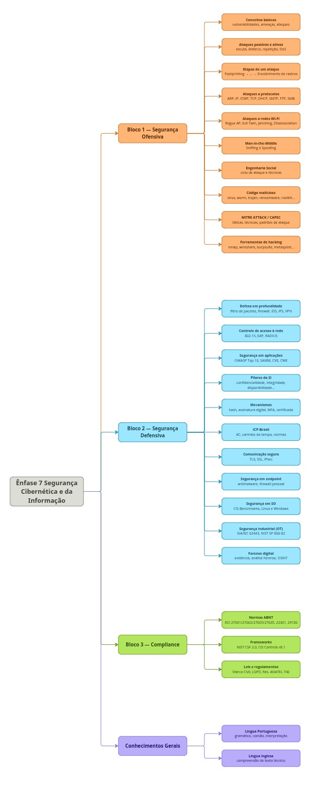

# Sobre

Decidi que vou estar concorrendo um concurso para uma vaga de Cyber Security e para isso vou ter que **pausar** meu cronograma principal.

Vou deixar registrado aqui o que eu etudar sobre o assunto da prova assim como feito no cronograma original.

# Cronograma

A imagem é uma representação do conteúdo a ser estudado.

O conteudo completo pode ser encontrada no [Guia de Estudos](./guia-estudos.md) que se encontra na mesma pasta.

