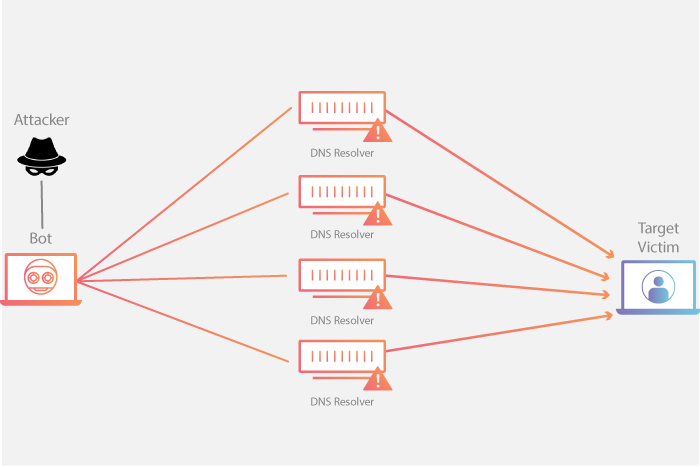

# Escuta Ativa

> Capturar pacotes

> Interferir ativamente na comunicação

> Manipulando ou injetando dados

> Ex: Ataque men in the middle

## Men in The Middle

O ataque Man-in-the-Middle (MitM), ou "homem no meio", acontece quando um invasor intercepta e possivelmente altera em segredo a comunicação entre duas partes que acreditam estar falando diretamente uma com a outra.

### Como Funciona o Ataque
• Interceptação: O criminoso se posiciona entre o usuário e um servidor ou outro dispositivo.
• Escuta e Modificação: Ele consegue ler e modificar os dados enviados (como senhas ou dados bancários) sem que as vítimas percebam.
• Repasse: O atacante retransmite a mensagem alterada para o destino final, fingindo ser a outra parte legítima.

### Como se Proteger
• Use HTTPS: Sempre verifique se o site possui certificado de segurança válido antes de inserir dados.
• Evite Wi-Fi Público: Redes sem senha em locais públicos facilitam a interceptação de tráfego não criptografado.
• Utilize uma VPN: Redes virtuais privadas criptografam seus dados e dificultam a ação de invasores na mesma rede.

# Spoffing - Disfarce

> Falsifica a identidade para parecer verdadeiro

> Ex: Spoofing de IP

---

## Spoofing de IP
O spoofing de IP é um ataque cibernético em que um invasor altera o endereço IP de origem em pacotes de dados para fingir ser outra máquina ou ocultar sua identidade real.

### Como Funciona
• O protocolo TCP/IP básico confia no endereço de destino para entregar pacotes, mas não valida se o IP de origem informado é verdadeiro.

• O invasor manipula o cabeçalho do pacote IP e insere um endereço falso.

• O sistema que recebe o dado acredita que a mensagem veio de uma fonte confiável ou de outro dispositivo.

• Como o cabeçalho é forjado, respostas a essas requisições vão para o IP falsificado, e não para o atacante

### Principais Objetivos

• Ataques de Negação de Serviço (DDoS): Inundam um alvo com tráfego falso, dificultando o rastreamento da origem real.

• Ocultação de identidade: Permite que invasores tentem burlar sistemas de segurança sem expor seu IP real.

• Bypass de autenticação: Tenta enganar redes internas que confiam apenas no endereço IP para conceder acesso.

### Como se Proteger
• Filtragem de pacotes (Anti-spoofing): Operadoras e empresas usam diretrizes como BCP38 para bloquear tráfego de saída com IPs inválidos.

• Uso de criptografia: Protocolos seguros e VPNs ajudam a proteger a integridade dos dados transmitidos.

• Monitoramento de rede: Ferramentas de detecção identificam padrões de tráfego incomuns ou pacotes com origens suspeitas.

---

# Replay Attack

Um ataque de repetição ocorre quando um invasor intercepta uma transmissão de dados válida em uma rede e a reenvia posteriormente para se passar pelo usuário legítimo.

## Como funciona o ataque
• O usuário envia dados legítimos para um servidor, como um pedido de login ou uma senha criptografada.

• O invasor intercepta e grava essa mensagem na rede.

• O invasor retransmite os mesmos dados para o sistema mais tarde.

• O sistema aceita o pedido porque os dados são reais, permitindo o acesso não autorizado.

## Formas de prevenção
• Nonce: Uso de um número aleatório de uso único em cada mensagem.

• Timestamp: Adição de marcas de tempo para que o servidor rejeite mensagens antigas.

• Criptografia: Proteção do tráfego para impedir a leitura e a cópia de pacotes de dados.

• Consulte o guia do Avast para mais dicas de proteção digital.

---
---
# Negaçao de Serviço

## DOS (Denial of Service)
Um ataque DoS (Denial of Service, ou negação de serviço) é uma ação maliciosa que visa sobrecarregar um sistema, servidor ou rede para torná-lo indisponível aos utilizadores legítimos.

### Como funciona
• Sobrecarga por tráfego: O atacante envia um volume excessivo de dados ou solicitações falsas para o alvo.

• Esgotamento de recursos: O sistema esgota a capacidade de processamento, memória ou largura de banda, travando ou parando de responder.

• Origem única: Diferente do DDoS (que usa vários computadores distribuídos), o DoS tradicional parte de uma única máquina ou conexão.

### Principais tipos

• Inundação (Flooding): Envio massivo de pings ou pacotes (como ICMP) para saturar a banda.

• Estouro de buffer (Buffer Overflow): Envio de mais dados do que o sistema pode armazenar na memória temporária para causar falhas.

• Exploração de falhas: Uso de vulnerabilidades no software para travar o serviço diretamente

## DDOS
Um ataque DDoS (Negação de Serviço Distribuída) é uma tentativa maliciosa de derrubar um site, servidor ou rede, sobrecarregando-o com um volume enorme de acessos falsos ao mesmo tempo.

### Como Funciona

• Redes zumbis (Botnets): O invasor usa milhares de dispositivos infectados por vírus, como computadores, roteadores e câmeras de segurança.

• Excesso de tráfego: Todos esses aparelhos enviam pedidos ao mesmo tempo para o site alvo.

• Queda do sistema: O servidor não aguenta tantas mensagens, esgota seus recursos e sai do ar para os usuários reais.

### Principais Tipos

• Volumétricos: Inundam a rede com dados gigantescos para travar a conexão (como amplificação DNS).

• De Protocolo: Atacam os pontos de conexão do sistema (como o SYN Flood), esgotando a memória do servidor.

• De Camada de Aplicação: Focam em páginas específicas ou pedidos complexos de HTTP para esgotar os recursos do site.

### Como se Proteger

• Redes Anycast: Distribuem o tráfego por vários servidores no mundo para absorver o impacto.

• Limitação de taxa (Rate Limiting): Controla o número de pedidos que um endereço IP pode fazer em pouco tempo.

• Firewall de Aplicação Web (WAF): Ajuda a filtrar e bloquear acessos suspeitos antes que cheguem ao servidor principal.

## Amplification DDOS ou DrDoS (Distributed Reflection Denial of Service)

> Conteudo tirado do site da Claudflare

Conteudo completo em: [DNS amplificaton attack](https://www.cloudflare.com/learning/ddos/dns-amplification-ddos-attack/)

### What is a DNS amplification attack?
This DDoS attack is a reflection-based volumetric distributed denial-of-service (DDoS) attack in which an attacker leverages the functionality of open DNS resolvers in order to overwhelm a target server or network with an amplified amount of traffic, rendering the server and its surrounding infrastructure inaccessible.

### How does a DNS amplification attack work?
All amplification attacks exploit a disparity in bandwidth consumption between an attacker and the targeted web resource. When the disparity in cost is magnified across many requests, the resulting volume of traffic can disrupt network infrastructure. By sending small queries that result in large responses, the malicious user is able to get more from less. By multiplying this magnification by having each bot in a botnet make similar requests, the attacker is both obfuscated from detection and reaping the benefits of greatly increased attack traffic.

A single bot in a DNS amplification attack can be thought of in the context of a malicious teenager calling a restaurant and saying “I’ll have one of everything, please call me back and tell me my whole order.” When the restaurant asks for a callback number, the number given is the targeted victim’s phone number. The target then receives a call from the restaurant with a lot of information that they didn’t request.

As a result of each bot making requests to open DNS resolvers with a spoofed IP address, which has been changed to the real source IP address of the targeted victim, the target then receives a response from the DNS resolvers. In order to create a large amount of traffic, the attacker structures the request in a way that generates as large a response from the DNS resolvers as possible. As a result, the target receives an amplification of the attacker’s initial traffic, and their network becomes clogged with the spurious traffic, causing a denial-of-service.

DNS Amplification DDoS Attack Diagram

### A DNS amplification can be broken down into four steps:

- The attacker uses a compromised endpoint to send UDP packets with spoofed IP addresses to a DNS recursor. The spoofed address on the packets points to the real IP address of the victim.

- Each one of the UDP packets makes a request to a DNS resolver, often passing an argument such as “ANY” in order to receive the largest response possible.

- After receiving the requests, the DNS resolver, which is trying to be helpful by responding, sends a large response to the spoofed IP address.

- The IP address of the target receives the response and the surrounding network infrastructure becomes overwhelmed with the deluge of traffic, resulting in a denial-of-service.

While a few requests is not enough to take down network infrastructure, when this sequence is multiplied across multiple requests and DNS resolvers, the amplification of data the target receives can be substantial.

### How is a DNS amplification attack mitigated?
For an individual or company running a website or service, mitigation options are limited. This comes from the fact that the individual’s server, while it might be the target, is not where the main effect of a volumetric attack is felt. Due to the high amount of traffic generated, the infrastructure surrounding the server feels the impact. The Internet Service Provider (ISP) or other upstream infrastructure providers may not be able to handle the incoming traffic without becoming overwhelmed. As a result, the ISP may blackhole all traffic to the targeted victim’s IP address, protecting itself and taking the target’s site off-line. Mitigation strategies, aside from offsite protective services like Cloudflare DDoS protection, are mostly preventative Internet infrastructure solutions.

#### Reduce the total number of open DNS resolvers

An essential component of DNS amplification attacks is access to open DNS resolvers. By having poorly configured DNS resolvers exposed to the Internet, all an attacker needs to do to utilize a DNS resolver is to discover it. Ideally, DNS resolvers should only provide their services to devices that originate within a trusted domain. In the case of reflection based attacks, the open DNS resolvers will respond to queries from anywhere on the Internet, allowing the potential for exploitation. Restricting a DNS resolver so that it will only respond to queries from trusted sources makes the server a poor vehicle for any type of amplification attack.

#### Source IP verification – stop spoofed packets leaving network

Because the UDP requests being sent by the attacker’s botnet must have a source IP address spoofed to the victim’s IP address, a key component in reducing the effectiveness of UDP-based amplification attacks is for Internet service providers (ISPs) to reject any internal traffic with spoofed IP addresses. If a packet is being sent from inside the network with a source address that makes it appear like it originated outside the network, it’s likely a spoofed packet and can be dropped. Cloudflare highly recommends that all providers implement ingress filtering, and at times will reach out to ISPs who are unknowingly taking part in DDoS attacks and help them realize their vulnerability.

## Smurf
O ataque Smurf é um tipo de ataque cibernético de negação de serviço distribuído (DDoS) que sobrecarrega um sistema-alvo com pacotes ICMP (pings) usando endereços IP falsificados e redes de transmissão (broadcast).

### Como Funciona o Ataque Smurf
- Falsificação de IP (Spoofing): O invasor cria pacotes de solicitação de eco ICMP (pings) com o endereço IP de origem alterado para o do alvo.
- Envio em Broadcast: O invasor envia esses pacotes para o endereço de broadcast de uma rede intermediária grande.
- Amplificação: Os dispositivos dessa rede respondem ao ping enviando o tráfego de volta para o IP falsificado da vítima.
- Inundação: Milhares ou milhões de respostas sobrecarregam a largura de banda e os recursos da vítima, tirando o sistema do ar.

## Teardrop

Um ataque Teardrop é um tipo clássico de ataque de Negação de Serviço (DoS) que envia pacotes de dados IP fragmentados e propositalmente sobrepostos para desestabilizar ou derrubar um sistema vulnerável.

Como os sistemas operacionais modernos já possuem defesas nativas contra essa falha, o ataque é considerado obsoleto no cenário atual de cibersegurança, mas ainda serve como um exemplo fundamental de como vulnerabilidades em protocolos de rede podem ser exploradas.
### Como funciona o ataque Teardrop?
Quando arquivos grandes ou dados são transmitidos pela internet, o protocolo TCP/IP divide essa informação em pedaços menores chamados fragmentos. Cada pedaço possui um campo no cabeçalho chamado Fragment Offset (deslocamento de fragmento), que diz ao sistema de destino a posição exata de cada parte para que ele possa remontar o arquivo original corretamente.
#### O ataque funciona da seguinte forma:
1. Envio malformado: O atacante altera o campo Fragment Offset dos pacotes, fazendo com que as porções de dados tenham tamanhos incoerentes e se sobreponham umas às outras.
2. Confusão no recebimento: Quando a máquina da vítima tenta juntar as peças, o bug no código de remontagem do protocolo TCP/IP não sabe como lidar com os dados sobrepostos.
3. Efeito cascata: O sistema operacional entra em loop, esgota seus recursos de memória tentando resolver o problema e sofre uma falha fatal, resultando em travamentos completas (crash) ou na famosa Tela Azul da Morte.
### Sistemas que eram vulneráveis
Esse ataque ganhou notoriedade no final dos anos 1990 e visava principalmente falhas de implementação de pilhas TCP/IP em softwares antigos ou sem atualizações:
- Versões antigas do Windows: Windows 3.1x, Windows 95, Windows 98 e Windows NT.
  
- Sistemas Linux desatualizados: Versões do Kernel Linux anteriores à 2.0.32 ou 2.1.63.

### Como a mitigação é feita hoje?
Embora o risco seja mínimo hoje em dia, as seguintes práticas e tecnologias eliminaram essa ameaça:
- Sistemas Operacionais Atualizados: Fabricantes como a Microsoft lançaram correções (patches) ainda nos anos 90, tornando os sistemas imunes ao problema.
  
- Firewalls e IDs/IPS: Ferramentas modernas de proteção de borda, como roteadores corporativos e soluções de marcas como a F5 BIG-IP, inspecionam o alinhamento dos pacotes recebidos. Se um pacote com sobreposição ou desalinhado é detectado, ele é sumariamente descartado antes mesmo de atingir a rede interna.